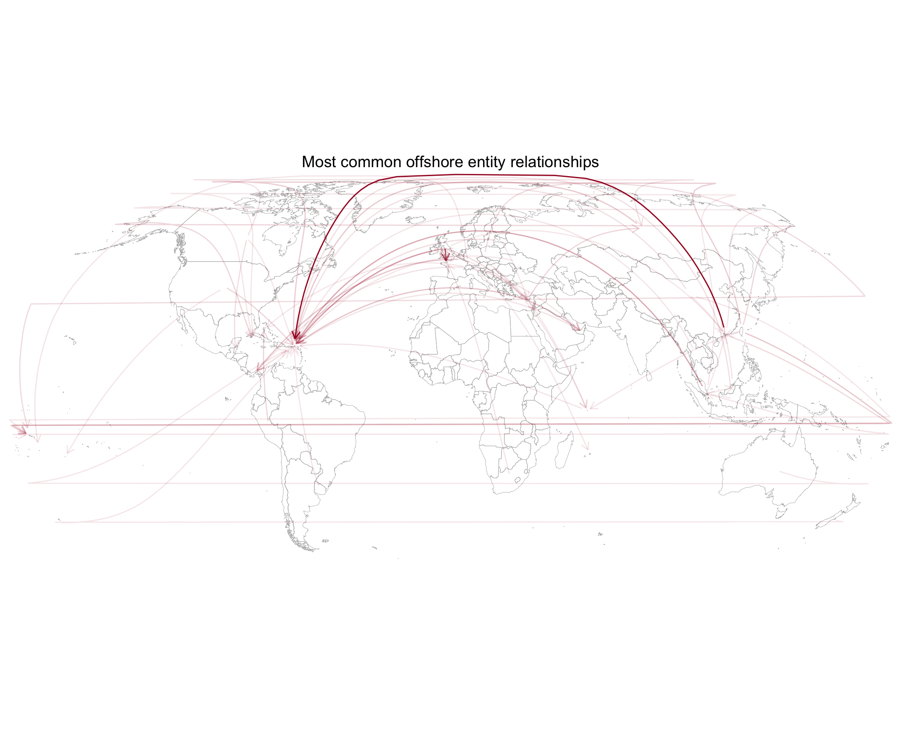

<!-- README.md is generated from README.Rmd. Please edit that file -->
The Panama Papers in R
----------------------

This provides the datasets from the ICIJ Offshore Leaks Database from the Panama Papers. This dataset was constructed by the International Consortium of Investigative Journalists and available [here](https://offshoreleaks.icij.org/pages/database) under the [Creative Commons Attribution-ShareAlike](http://creativecommons.org/licenses/by-sa/3.0/) license. Besides that data, this package is available under GPL-3.

Future versions of this package may soon include other data from the Panama Papers besides the offshore leaks dataset.

### Installation

Install using [devtools](https://github.com/hadley/devtools):

    devtools::install_github("dgrtwo/rpanama")

### Offshore Leaks

There are five main datasets that this package provides. First is information on the Entities, Intermediaries, Officers, and Addresses from the offshore leaks dataset (see [here](https://offshoreleaks.icij.org/pages/about#terms_definition) for the definitions of each):

``` r
library(rpanama)
library(dplyr)

Entities
#> Source: local data frame [319,150 x 21]
#> 
#>                                           name
#>                                          (chr)
#> 1     TIANSHENG INDUSTRY AND TRADING CO., LTD.
#> 2  NINGBO SUNRISE ENTERPRISES UNITED CO., LTD.
#> 3                           HOTFOCUS CO., LTD.
#> 4              SKY-BLUE GIFTS & TOYS CO., LTD.
#> 5         FORTUNEMAKER INVESTMENTS CORPORATION
#> 6                         8808 HOLDING LIMITED
#> 7                     KENT DEVELOPMENT LIMITED
#> 8                          BONUS TRADE LIMITED
#> 9                               AMARANDAN LTD.
#> 10                            NEW IDEA LIMITED
#> ..                                         ...
#> Variables not shown: original_name (chr), former_name (chr), jurisdiction
#>   (chr), jurisdiction_description (chr), company_type (chr), address
#>   (chr), internal_id (int), incorporation_date (chr), inactivation_date
#>   (chr), struck_off_date (chr), dorm_date (chr), status (chr),
#>   service_provider (chr), ibcRUC (chr), country_codes (chr), countries
#>   (chr), note (chr), valid_until (chr), node_id (int), sourceID (chr)
Intermediaries
#> Source: local data frame [23,636 x 9]
#> 
#>                          name internal_id
#>                         (chr)       (int)
#> 1     MICHAEL PAPAGEORGE, MR.       10001
#> 2          CORFIDUCIA ANSTALT       10004
#> 3               DAVID, RONALD       10014
#> 4  DE  BOUTSELIS, JEAN-PIERRE       10015
#> 5    THE LEVANT LAWYERS (TLL)       10029
#> 6           ABARTH, ANNELIESE        1004
#> 7         FIGEST CONSEIL S.A.       10064
#> 8           MED ENERGY S.A.L.       10106
#> 9      TRUSTCO LABUAN SDN BHD       10116
#> 10      SYL LOGIC SERVICES SA       10121
#> ..                        ...         ...
#> Variables not shown: address (chr), valid_until (chr), country_codes
#>   (chr), countries (chr), status (chr), node_id (int), sourceID (chr)
Officers
#> Source: local data frame [345,594 x 7]
#> 
#>                                 name                          icij_id
#>                                (chr)                            (chr)
#> 1                         KIM SOO IN E72326DEA50F1A9C2876E112AAEB42BC
#> 2                          Tian Yuan 58287E0FD37852000D9D5AB8B27A2581
#> 3               GREGORY JOHN SOLOMON F476011509FD5C2EF98E9B1D74913CCE
#> 4                     MATSUDA MASUMI 974F420B2324A23EAF46F20E178AF52C
#> 5                        HO THUY NGA 06A0FC92656D09F63D966FE7BD076A45
#> 6                     RACHMAT ARIFIN 14BCB3A8F783A319511E6C5EF5F4BB30
#> 7                        TAN SUN-HUA C3912EA62746F395A64FB216BE464F61
#> 8      Ou Yang Yet-Sing and Chang Ko DB896EE47F60BB1B2E9EA9C10ACBFCD7
#> 9  Wu Chi-Ping and Wu Chou Tsan-Ting 1B92FDDD451DA8DCA9CD36B0AF797411
#> 10                     ZHONG LI MING 0AE47CB442426F2ACF73E42BFA6657FA
#> ..                               ...                              ...
#> Variables not shown: valid_until (chr), country_codes (chr), countries
#>   (chr), node_id (int), sourceID (chr)
Addresses
#> Source: local data frame [151,054 x 7]
#> 
#>                                                                        address
#>                                                                          (chr)
#> 1                                 -\t27 ROSEWOOD DRIVE #16-19 SINGAPORE 737920
#> 2                                      "Almaly Village" v.5, Almaty Kazakhstan
#> 3                      "Cantonia" South Road St Georges Hill Weybridge, Surrey
#> 4                     "CAY-OS" NEW ROAD; ST.SAMPSON; GUERNSEY; CHANNEL ISLANDS
#> 5            "Chirag" Plot No 652; Mwamba Road; Kizingo; Mombasa; 80100; Kenya
#> 6                             "La Diana"; 16 rue Del Respiro; MC 98000 Monaco.
#> 7  "Les hauts de St Jean"; 17 avenue Perdtemts; Canton de Vaud; CH-1260 Nyon (
#> 8                                    "Les Tattes"; Bursinel; Vaud; Switzerland
#> 9                           "Quai Kennedy" 1 boulevard Louis II Monaco MC98000
#> 10          "Sofia House" 48 Church Street; 1st Floor; Hamilton HM 12; Bermuda
#> ..                                                                         ...
#> Variables not shown: icij_id (chr), valid_until (chr), country_codes
#>   (chr), countries (chr), node_id (int), sourceID (chr)
```

These each make up nodes in a network. The `all_edges` dataset contains connections between these, including which entities have which offshore accounts.

``` r
all_edges
#> Source: local data frame [1,269,796 x 3]
#> 
#>      node_1        rel_type   node_2
#>       (int)           (chr)    (int)
#> 1  11000001 intermediary of 10208879
#> 2  11000001 intermediary of 10198662
#> 3  11000001 intermediary of 10159927
#> 4  11000001 intermediary of 10165779
#> 5  11000001 intermediary of 10152967
#> 6  11000002 intermediary of 10005174
#> 7  11000002 intermediary of 10008130
#> 8  11000002 intermediary of 10011418
#> 9  11000002 intermediary of 10010781
#> 10 11000002 intermediary of 10188436
#> ..      ...             ...      ...

all_edges %>%
  count(rel_type, sort = TRUE)
#> Source: local data frame [84 x 2]
#> 
#>                       rel_type      n
#>                          (chr)  (int)
#> 1              intermediary of 319121
#> 2           registered address 316472
#> 3               shareholder of 277380
#> 4                  Director of 118589
#> 5               Shareholder of 105408
#> 6  similar name and address as  46761
#> 7       Records & Registers of  36318
#> 8               beneficiary of  15151
#> 9                 Secretary of  14351
#> 10              Beneficiary of   4031
#> ..                         ...    ...
```

Each of the five above datasets comes directly from the CSVs released by the ICIJ [here](https://offshoreleaks.icij.org/pages/database).

### Example

We could find which countries have the most offshore entities (note that there are multiple countries split by `;`):

``` r
library(tidyr)
library(stringr)

most_common_countries <- Entities %>%
  select(node_id, countries) %>%
  unnest(country = str_split(countries, ";")) %>%
  count(country, sort = TRUE)

most_common_countries
#> Source: local data frame [166 x 2]
#> 
#>                    country     n
#>                      (chr) (int)
#> 1  Virgin Islands, British 69092
#> 2                Hong Kong 51295
#> 3              Switzerland 38077
#> 4           Not identified 25700
#> 5                   Panama 18122
#> 6           United Kingdom 17973
#> 7                   Jersey 14562
#> 8       Russian Federation 11516
#> 9               Luxembourg 10877
#> 10                   Samoa  9729
#> ..                     ...   ...
```

We may also find inter-country intermediary relationships were most common. We could do this by joining the `Intermediaries` data with the `all_edges` data and then the `Entities` data:

``` r
entity_countries <- Entities %>%
  unnest(entity_country = str_split(countries, ";"),
         entity_code = str_split(country_codes, ";")) %>%
  select(node_id, entity_country, entity_code)

connections <- Intermediaries %>%
  unnest(intermediary_country = str_split(countries, ";"),
         intermediary_code = str_split(country_codes, ";")) %>%
  inner_join(all_edges, by = c(node_id = "node_1")) %>%
  inner_join(entity_countries, by = c(node_2 = "node_id")) %>%
  filter(rel_type == "intermediary of",
         intermediary_country != entity_country) %>%
  count(intermediary_country, entity_country, intermediary_code, entity_code) %>%
  ungroup() %>%
  arrange(desc(n))

connections
#> Source: local data frame [869 x 5]
#> 
#>         intermediary_country          entity_country intermediary_code
#>                        (chr)                   (chr)             (chr)
#> 1                  Hong Kong Virgin Islands, British               HKG
#> 2             United Kingdom                  Jersey               GBR
#> 3                  Hong Kong          Not identified               HKG
#> 4                  Singapore Virgin Islands, British               SGP
#> 5             United Kingdom                Guernsey               GBR
#> 6             United Kingdom Virgin Islands, British               GBR
#> 7                     Cyprus    United Arab Emirates               CYP
#> 8                     Cyprus Virgin Islands, British               CYP
#> 9                 Luxembourg                  Panama               LUX
#> 10 Taiwan, Province of China                   Samoa               TWN
#> ..                       ...                     ...               ...
#> Variables not shown: entity_code (chr), n (int)
```

We could even put this on a map:

``` r
library(rworldmap)
library(geosphere)

country_centers <- getMap()@data %>%
  tbl_df() %>%
  select(code = ISO_A3, longitude = LON, latitude = LAT)

great_circles <- connections %>%
  filter(n > 100) %>%
  mutate(connection = row_number()) %>%
  select(intermediary_code, entity_code, n, connection) %>%
  gather(type, code, contains("code")) %>%
  inner_join(country_centers, by = "code") %>%
  group_by(connection, n) %>%
  arrange(desc(type)) %>%
  filter(n() == 2) %>%
  do(as.data.frame(gcIntermediate(c(.$longitude[1], .$latitude[1]),
                                  c(.$longitude[2], .$latitude[2]))))

library(ggplot2)
library(ggthemes)
library(ggalt)

world_map <- filter(map_data("world"), region != "Antarctica")

ggplot() +
  geom_map(data = world_map, map = world_map,
           aes(x = long, y = lat, map_id = region),
           color = "#b2b2b2", size = 0.15, fill = NA) +
  geom_path(data=great_circles, color = "#a50026", 
            aes(lon, lat, group = connection, alpha = n),
            arrow = arrow(length = unit(0.1, "inches"))) +
  scale_color_gradient2(low = "white", high = "#a50026", trans = "log") +
  coord_proj() +
  labs(title = "Most common offshore entity relationships") +
  theme_map(base_family="Arial") +
  #scale_size_continuous(trans = "log", range = c(.1, 1)) +
  theme(legend.position = "none", 
        plot.title=element_text(hjust = 0.5, size = 14))
```


